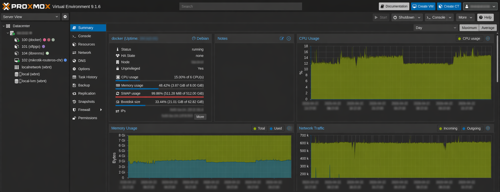
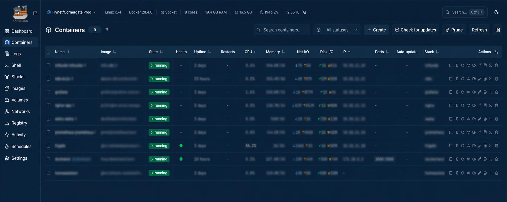

# Deployment (Docker on LXC)

## Overview

The monitoring stack runs as Docker containers inside a **Debian 12 LXC** on a
**Proxmox VE** host. InfluxDB and Grafana each run as isolated containers managed
via docker-compose, with named volumes for persistent data storage.

Grafana is exposed securely via **Nginx Proxy Manager** with a **Let's Encrypt SSL
certificate**, proxied through **Cloudflare** for DNS management and CDN.

---

## Environment

| Component | Detail |
|---|---|
| Hypervisor | Proxmox VE |
| Container Type | LXC (Debian 12) |
| Runtime | Docker + Docker Compose |
| InfluxDB | v2.0 |
| Grafana | Latest stable |
| Reverse Proxy | Nginx Proxy Manager |
| SSL | Let's Encrypt |
| DNS & CDN | Cloudflare |

---

## Architecture

```
Raspberry Pi (VenusOS + Node-RED)
        │
        │ InfluxDB Line Protocol
        ▼
  Proxmox LXC (Debian 12)
  ┌──────────────────────────────────────┐
  │  Docker                              │
  │  ├── InfluxDB          (:8086)       │
  │  ├── Grafana           (:3000)       │
  │  └── Nginx Proxy Manager (:80/:443)  │
  └──────────────────────────────────────┘
        │
        │ HTTPS (Let's Encrypt SSL)
        ▼
  Cloudflare (DNS + CDN + Proxy)
        │
        │ HTTPS
        ▼
  grafana.yourdomain.com
```

---

## Proxmox LXC



---

## Docker Containers



---

## Nginx Proxy Manager

Nginx Proxy Manager handles reverse proxying Grafana to a public domain with a
Let's Encrypt SSL certificate. The NPM admin panel is accessible on port `81`.

| Setting | Value |
|---|---|
| Domain | `grafana.yourdomain.com` |
| Forward Hostname | `grafana` (container name) |
| Forward Port | `3000` |
| SSL | Let's Encrypt, Force SSL enabled |

---

## Cloudflare

Cloudflare sits in front of the stack handling DNS, CDN, and an additional layer
of security. All traffic flows through Cloudflare's network before reaching the LXC.

| Setting | Value |
|---|---|
| DNS Record | `A` record pointing to public IP |
| Proxy Status | ✅ Proxied (orange cloud) |
| SSL Mode | **Full (Strict)** |
| CDN | ✅ Enabled via Cloudflare proxy |

> SSL mode must be set to **Full (Strict)** — Flexible will cause redirect loops
> between Cloudflare and Nginx Proxy Manager.
